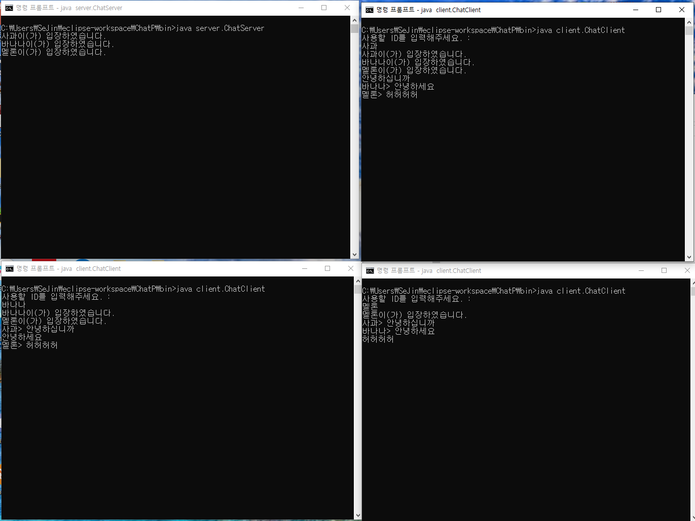

토이프로젝트
=================

간단한 토이 프로젝트 모음 입니다.

1.JAVA SimPle_chat
-----------------
자바를 쓰레드를 이용한 간단한 채팅 프로그램
추후 JAVA_FX 이용한 UI 개발 예정

2.ToDoList - java
-----------------

자바를 이용한 ToDoList 만들기    

개요. 내가 사용할 ToDoList 프로그램을 만들자.    

사용 Tool - 이클립스, JavaFX Scene Builder     

Scean Builder - https://m.blog.naver.com/PostView.nhn?blogId=ndb796&logNo=221203295632&proxyReferer=https:%2F%2Fwww.google.com%2F
